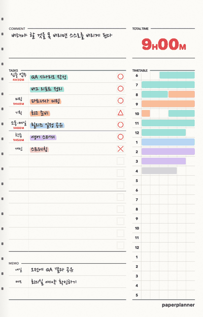
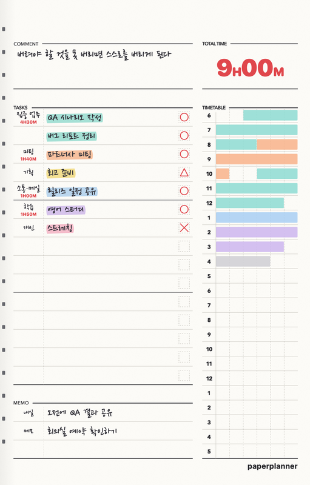
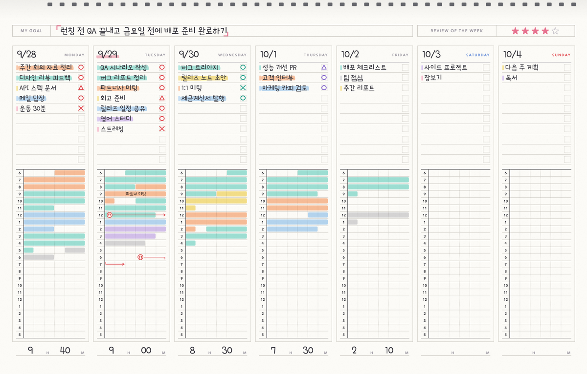
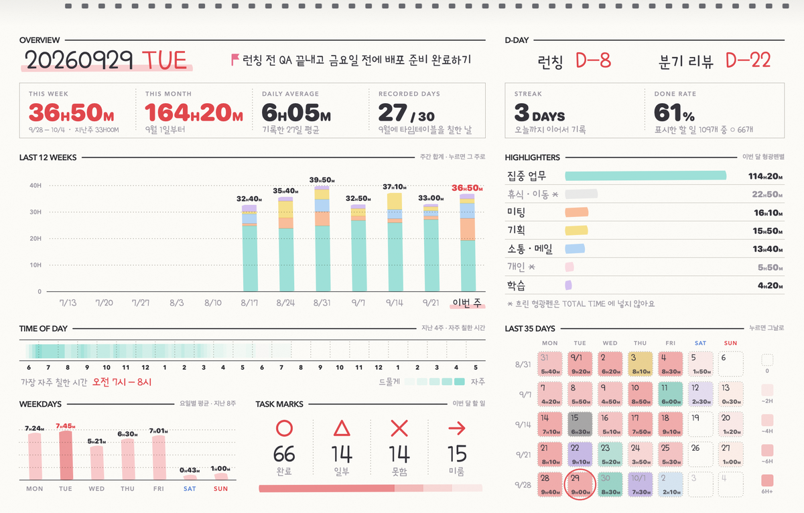
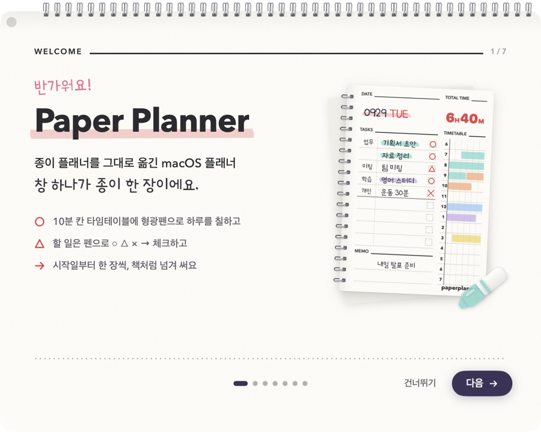
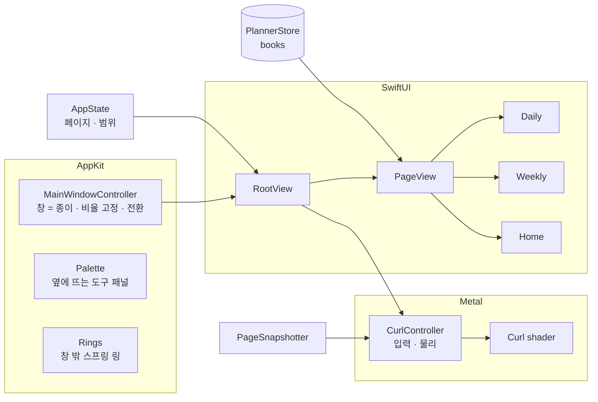

<div align="center">

# Spiralday

[](https://github.com/Grwaywee/spiralday)<br>
<sub>도움이 됐다면 ⭐ 하나 눌러 주세요 — 계속 만드는 데 큰 힘이 돼요.</sub>

**창 하나가 곧 종이 한 장인 macOS 플래너.** · [spiralday.com](https://spiralday.com)
10분 단위 종이 플래너 형식에 하루를 적고, 스프링 노트처럼 한 장씩 넘깁니다.


[](#라이선스)



[다운로드](#설치) · [기능](#주요-기능) · [사용법](#사용법) · [PDF 인쇄](#pdf로-뽑기) · [개발](#개발)

</div>

---

## 왜 만들었나

종이 플래너의 좋은 점은 **한 장 안에 하루가 다 보인다**는 것과 **넘기는 손맛**입니다. 캘린더 앱에는 둘 다 없습니다.

Spiralday 는 앱 안에 플래너를 그려 넣지 않고 **창 자체를 종이 한 장**으로 만들었습니다. 창의 빨강·노랑·초록 버튼이 종이 왼쪽 위에 놓이고, 스프링 링은 창 밖으로 튀어나와 있으며, 페이지는 **Metal 로 계산한 진짜 종이 말림**으로 넘어갑니다.

## 주요 기능

| | |
|---|---|
| 📓 **플래너 여러 권** | 권마다 이름 · **시작일(필수)** · 종료일(선택) · 표지 색. 시작일 이전 / 종료일 이후로는 넘어가지 않고, 종료일이 없으면 계속 넘어갑니다. 권마다 기록 · 형광펜 · D-day 가 따로 저장됩니다. |
| 📕 **표지와 첫 장** | 일간 · 주간 모두 책 맨 앞에 **표지**(이름 · 기간 · 표지 색)와 하고 싶은 말을 적는 **첫 장**이 있습니다. 표지 → 첫 장 → 첫날(첫 주) 순서로 넘어갑니다. |
| 🗒 **일간** | 10분 단위 종이 플래너 형식 — DATE · D-DAY · COMMENT · TOTAL TIME · TASKS 15줄 · MEMO · TIMETABLE (06시–05시 × 10분). 할 일은 **아무 줄에나 먼저 쓰고, 형광펜(분류)은 나중에** 왼쪽 칸을 눌러 고릅니다. 긴 할 일은 아래 빈 줄까지 이어 쓰고, 막히면 글씨를 줄여 제 줄에 맞춥니다. MEMO 는 칸이 모자라면 줄 간격과 글씨가 함께 조금씩 줄어듭니다. |
| 📅 **주간** | MY GOAL (┌ … ┘ 강조), REVIEW OF THE WEEK ★, 월–일 7칸 — 할 일 10줄 · 타임테이블 · 하루 합계. 위아래 여백을 줄이고 그만큼 타임테이블을 크게 잡았습니다. |
| 📊 **홈** | 이번 주 · 이번 달 시간, 하루 평균, 연속 기록, 완료율, 최근 12주, 형광펜별 시간, 시간대 · 요일 패턴, 최근 35일 달력. |
| 🖍 **형광펜 타임테이블** | 팔레트에서 형광펜을 골라 10분 칸을 드래그로 칠하면 TOTAL TIME 이 계산됩니다 (TOTAL TIME 에 넣을지는 형광펜마다 설정에서). 팔레트의 펜은 타임테이블 칠하기 전용입니다. 타임테이블 위에 **손글씨 메모**, 🍴 **밥시간 화살표**. |
| 🧰 **도구 팔레트** | 종이 **오른쪽(기본) · 왼쪽 · 위 · 아래** 중 고른 쪽에 붙습니다 (위 · 아래는 가로 한 줄). `⌘\` 나 끝의 화살표로 **접으면** 지금 도구가 보이는 가느다란 손잡이만 남고, 손잡이에 마우스를 올리면 펼쳐집니다. 설정 → 팔레트에서 자리와 **자동으로 접기**를 고릅니다. |
| ○ △ × → | 체크 박스를 누를 때마다 완료 → 일부 → 못함 → 미룸. **완료한 일에만 그 할 일의 형광펜**이 그어집니다. **→ 로 미룬 일은 다음 날, 같은 형광펜 묶음 바로 아래로 넘어갑니다.** |
| 🚩 **날마다 D-day** | D-day 를 목록에 저장해 두고, 일간 페이지마다 골라 붙입니다 (하루 두 개까지). 붙인 D-day 는 그날에만 남아서 다음 날에 저절로 넘어가지 않고, 목록에서 고치거나 지워도 이미 붙인 날은 그대로입니다. |
| 🎨 **날마다 컬러** | 9가지 컬러 컨셉 — TOTAL TIME · 요일 · D-day · 체크 표시 색이 함께 바뀝니다. 기본값은 설정에서. |
| 🖨 **PDF 로 뽑기** | 일간 A4 세로 / **A4 반쪽 (두 장씩, 자르면 실물 크기)**, 주간 · 홈 A4 가로. 기간을 정해 한 번에, 맨 앞에 표지와 첫 장까지. 벡터라 인쇄가 선명합니다. |
| 🧭 **둘러보기** | 처음 플래너를 펼치면 일간 → 주간 → 홈 → 표지 · 첫 장 순서로 쓰는 법을 하나씩 짚어 줍니다. 튜토리얼과 둘러보기는 설정에서 언제든 골라 다시 볼 수 있습니다. |
| 🔒 **내 Mac 에 · 원하면 내 기기끼리** | 계정 없음, 광고 없음. 기록은 JSON 파일로 내 Mac 에 저장. **Spiralday Sync** 를 켜면 내 iPhone · iPad · Windows PC 와 종단간 암호화로 맞춥니다 (기본은 꺼짐, 계정 없이 QR · 8자리 코드로 연결). 동기화를 켜지 않으면 인터넷은 하루 한 번 업데이트 확인과 익명 사용 통계(설정에서 끌 수 있음)에만 써요. |

## 화면

<table>
<tr>
<td width="38%" valign="top"><br><sub>일간</sub></td>
<td valign="top"><br><sub>주간 — 위쪽 스프링</sub><br><br><br><sub>홈 — 전체 통계</sub></td>
</tr>
</table>

## 설치

### 받아서 쓰기

1. [spiralday.com](https://spiralday.com) 또는 [Releases](https://github.com/Grwaywee/spiralday/releases/latest) 에서 **`Spiralday.dmg`** 를 받아 엽니다.
2. 열린 창에서 **Spiralday** 를 **Applications** 폴더로 끌어다 놓습니다.
3. 응용 프로그램 폴더(또는 Launchpad)에서 Spiralday 를 엽니다. 끝.

LeanAgileHungry Inc. 의 Developer ID 로 서명하고 Apple 공증(notarization)을 받은 앱이라, 따로 허용할 필요 없이 바로 열립니다.

- macOS 14 Sonoma 이상, Apple Silicon · Intel 모두 지원
- **자동 업데이트** — 하루 한 번 새 버전을 확인하고, 있으면 알려 줘요 (메뉴 Spiralday → 업데이트 확인…). [Sparkle](https://sparkle-project.org) 로 서명을 확인한 뒤 설치해요.

### 직접 빌드

Xcode 16 이상 (Swift 6 툴체인 — `swift-tools-version:6.0` · `Package.resolved` v3) 이 필요합니다.

```bash
git clone https://github.com/Grwaywee/spiralday.git
cd spiralday
./build.sh                  # → build/Spiralday.app (이 Mac 용)
open build/Spiralday.app
```

직접 빌드한 앱은 이 Mac 에서만 쓰는 애드혹 서명이고, 공증은 받지 않습니다. Apple Silicon · Intel 유니버설로 빌드하려면 `UNIVERSAL=1 ./build.sh`.

직접 빌드해 쓰는 것은 [라이선스](#라이선스)가 허용하는 목적 안에서 할 수 있습니다. 빌드한 앱을 남에게 나눠 줄 때는 라이선스의 고지(빌드한 `.app` 의 `Contents/Resources/Licenses/Spiralday-LICENSE.txt` 에 들어 있어요)를 함께 주고, [TRADEMARKS.md](TRADEMARKS.md) 대로 이름 · 아이콘 · 번들 id · 데이터 폴더 · 업데이트 피드와 키 · 동기화 서버 · 통계 주소를 바꿔 주세요.

직접 빌드한 `.app` 은 설치한 Spiralday 와 번들 id 가 같아서 같은 데이터 폴더 · 설정 · 동기화 열쇠(로그인 키체인의 `com.spiralday.sync`)를 씁니다. 애드혹 서명은 빌드할 때마다 서명이 바뀌어서, 동기화를 켠 뒤에는 다시 빌드할 때마다 키체인이 접근을 허용할지 물어요. `swift run` · `.build/debug/Spiralday` 처럼 `.app` 이 아닌 실행은 데이터 폴더는 같지만 동기화 열쇠 · 상태는 따로(`com.spiralday.sync.dev` · `SyncState-dev`) 써서 설치한 앱의 동기화를 건드리지 않습니다 — 그래도 플래너 파일은 같은 폴더라, 동기화를 시험할 때는 `--demo` 나 디버그 빌드의 `--sync-drive <폴더>` (따로 된 폴더 · 키체인 이름) 를 쓰세요.

## 사용법

처음 열면 **튜토리얼**이 플래너 만들기부터 안내하고, 플래너를 펼치면 **둘러보기**가 이어집니다.

- **일간** — D-day 붙이기와 원리, COMMENT 와 DAY OFF, 할 일 쓰기 · 완료 표시 · → 넘기기, MEMO, 타임테이블 칠하기와 TOTAL TIME 에 들어가는 기준(설정에서 형광펜마다 포함 · 미포함), 펜 색 고르기, 글씨 · 밥, 오늘의 컬러, 넘기는 법 (단축키 · 클릭)
- **주간** — 위쪽에 이번 주 목표, 마무리하는 날에 리뷰 (별점). 아래 칸은 일간과 같습니다
- **홈** — 섹션마다 무엇을 볼 수 있는지
- **표지와 첫 장** — 첫 장에 하고 싶은 말 적기, 설정에서 PDF 로 뽑아 인쇄하거나 실제 책처럼 두기

튜토리얼과 둘러보기는 설정 → 튜토리얼에서 언제든, 보고 싶은 것을 골라 다시 볼 수 있습니다 (도움말 → 플래너 둘러보기로도 바로 시작).

책장에는 오늘까지 14일을 미리 채워 둔 **예시 플래너**도 한 권 꽂혀 있습니다. 팔레트 맨 위에서 펼쳐 형광펜 · 체크 표시 · D-day · 주간 목표가 어떻게 쓰이는지 둘러보고, 다 봤으면 설정 → 플래너에서 지우면 됩니다. 지워도 내 기록은 그대로이고, ‘예시 플래너 다시 넣기’로 언제든 다시 넣을 수 있습니다.



### 넘기기

| 동작 | 방법 |
|---|---|
| 다음 / 이전 장 | `→` / `←`, 팔레트 ‹ ›, `⌘]` / `⌘[` |
| 주간: 다음 / 이전 주 | 위의 것에 더해 `↓` / `↑`, `fn` + `↓` / `↑` (Page Down / Page Up) — 위로 묶인 종이라 위아래로도 넘겨요 |
| 잡고 넘기기 | 종이 아래 모서리를 끌기 (마우스를 올리면 모서리가 살짝 들려요) |
| 트랙패드 | 두 손가락 가로 스와이프 (종이 어디서나). 주간은 세로 스와이프도 — 위로 쓸면 다음 주 |
| 오늘 | `T` · `⌘T` |
| 표지 · 첫 장 | 첫날(첫 주)에서 `←` 두 번. 표지 앞으로는 넘어가지 않아요 |
| 홈 / 주간 / 일간 | `H` / `W` / `D` · `⌘0` / `⌘1` / `⌘2` |

### 쓰기

| 동작 | 방법 |
|---|---|
| 할 일 | **아무 빈 줄이나** 눌러 쓰기 (가운데 줄부터 써도 그 자리에 남아요). `Return` 은 아랫줄로 (비어 있으면 같은 형광펜으로 새 할 일), `↑` `↓` 는 윗줄 · 아랫줄로. 글을 다 지우면 그 할 일도 지워져요 |
| 할 일 분류 | 먼저 쓰고, 할 일의 **왼쪽 칸**을 눌러 형광펜 고르기 · 없음 (주간은 왼쪽 색 막대 자리). 이미 쓰는 형광펜을 고르면 그 묶음 바로 아래로 모여요 |
| 체크 | 체크 박스 클릭 (○ → △ → × → → → 없음). → 표시하면 다음 날로 넘어가요 (→ 를 떼면 손대지 않은 것은 거둬요) |
| 형광펜 | 팔레트에서 펜 클릭 또는 `1`–`7`, 지우개 `E` — 팔레트 펜은 타임테이블 칠하기 전용 |
| 시간 칠하기 | 타임테이블 드래그 (같은 색을 다시 칠하면 지워져요 — 지우개처럼 그 칸의 글씨 · 밥시간도 함께). TOTAL TIME 에 넣을지는 설정 → 형광펜에서 펜마다 |
| 글씨 / 밥시간 | 팔레트의 **글씨** · **밥** 을 고르고 칸을 누르거나 끌기 |
| COMMENT | 칸을 눌러 쓰기. `Return` 은 줄 바꿈 (다섯 줄까지, 길어지면 글씨가 작아져요) — `⌘↩` · `Esc` · 종이 빈 곳 클릭으로 끝 |
| 쉬는 날 | 일간 페이지의 COMMENT ▾ → DAY OFF (적어 둔 COMMENT 는 그대로, ▾ → 작성하기로 돌아와요) |
| 오늘의 컬러 | 팔레트의 색 동그라미 (오른쪽 클릭: 기본값으로) |
| 팔레트 접기 · 펼치기 | `⌘\` 또는 팔레트 끝의 작은 화살표 · 접힌 손잡이 (손잡이에 마우스를 올리면 잠깐 펼쳐지고, 누르면 펼친 채로 고정). 접혀 있어도 지금 도구로 칠할 수 있고, `1`–`7` · `E` 로 바꾸면 잠깐 펼쳐 보여 줘요 |
| D-day | 일간 페이지의 D-DAY 칸 또는 팔레트의 **D-day** (주간 · 홈에서는 오늘) → 저장한 D-day 에서 고르기 · 새로 만들기 · 어제와 같게. 붙이고 떼고 고친 것은 그날에만 |
| 하고 싶은 말 | 첫 장 가운데를 눌러 쓰기 (`⌥↩` 줄 바꿈) |
| 편집 끝 | `Esc` 또는 종이 빈 곳 클릭 |

### 설정 (`⌘,`)

플래너(여러 권) · 형광펜 이름/색/순서/TOTAL TIME 포함 · 컬러 컨셉 기본값 · 저장한 D-day 목록 (개수 제한 없음, 날마다 여기서 골라 붙이기) · PDF (표지와 첫 장 넣기) · 팔레트 (자리: 오른쪽 · 왼쪽 · 위 · 아래, 자동으로 접기) · 단축키 · 데이터 백업 · 튜토리얼과 둘러보기 다시 보기

## PDF로 뽑기

`⌘P` 또는 설정 → PDF

| 종류 | 용지 | 한 장에 |
|---|---|---|
| 일간 | A4 세로 | 하루 |
| 일간 | **A4 가로, 반씩** | 이틀 — 가운데 선을 따라 자르면 실물 플래너 크기 |
| 주간 | A4 가로 | 한 주 |
| 홈 | A4 가로 | 통계 |

일간 · 주간은 맨 앞에 **표지와 첫 장**을 넣을 수 있습니다 (기본 켜짐). A4 반쪽은 첫 장에 둘이 나란히 들어가서, 잘라 묶으면 실제 책처럼 가지고 다닐 수 있습니다.

기록이 없는 날은 빈 양식으로 나오니, 인쇄해서 종이 플래너로도 쓸 수 있습니다.

## 데이터

```
~/Library/Application Support/Spiralday/
├── library.json          # 플래너 목록, 펼친 플래너, 예시 플래너를 꽂았는지
└── books/<id>.json       # 플래너 한 권의 기록 · 형광펜 · 저장한 D-day · 날마다 붙인 D-day · 첫 장에 적은 말
```

1.0.3 에서 D-day 가 날마다 따로 붙도록 바뀌었습니다. 1.0.2 까지 쓰던 플래너를 처음 열면 원본을 `books/<id>.json.before-per-day-dday.json` 으로 남긴 뒤, 이미 쓴 날과 그날(오늘)에만 지금까지의 D-day 를 붙여서 전과 똑같이 보이게 옮깁니다. 이 사본은 그 플래너를 지울 때 함께 지워집니다.

1.0.5 부터 할 일마다 TASKS 의 줄 번호를 함께 적습니다. 1.0.4 까지 쓴 할 일은 처음 열 때 그때 보이던 줄 그대로 번호를 매기고, 다음에 저장할 때 파일에 적습니다.

입력은 즉시 자동 저장됩니다 (원자적 쓰기, 종료 시 즉시 저장). 백업은 폴더째 복사하거나 설정 → 데이터 → 백업 내보내기.

### 동기화 (Spiralday Sync)

설정 → 동기화에서 켭니다 (기본은 꺼짐). 첫 기기에서 **이 Mac 에서 시작하기** → 복구 코드를 적어 두고 (복사 · 텍스트 파일 · 인쇄 → 두 묶음을 다시 입력해 확인), 다른 기기에서는 **기기 추가** 의 QR 이나 8자리 코드로 들어옵니다. 처음 켠 Mac 은 처음 안내의 **다른 기기의 플래너를 동기화로 가져오기** 로 바로 합류할 수 있습니다 (새 플래너를 만들지 않고, 사용법과 둘러보기는 그대로 봅니다). 새 기기 화면의 숫자 4자리를 원래 기기에 입력해야 그룹 열쇠가 갑니다. 그 밖에 기기 목록 · 이름 바꾸기 · 빼기, 하루 · 한 주의 이전 버전(30일), 복구 코드 새로 만들기, 이 Mac 에서 끄기 · 그룹 지우기.

- 켜기 전에는 키체인도 네트워크도 건드리지 않습니다. 켜면 열쇠(기기 토큰 · 그룹 키)는 로그인 키체인(`com.spiralday.sync`, iCloud 키체인으로 동기화하지 않음)에, 동기화 상태는 `~/Library/Application Support/Spiralday/SyncState` (Time Machine 제외) 에 둡니다. 로그인 키체인과 설정은 이전 지원 · Time Machine 복원으로 새 Mac 에 옮겨 갈 수 있어서, 켤 때 그룹에 들어간 Mac 과 다른 Mac 이면 동기화를 멈추고 **이 Mac 에서 이어 쓰기**(원래 Mac 을 더 쓰지 않을 때) · **정리하기**(원래 Mac 도 쓸 때 — 이 Mac 은 다시 합류) 를 묻습니다. 두 Mac 이 한 기기로 붙지 않게 하려는 것입니다.
- 서버(`sync.spiralday.com`)는 암호문 · 불투명 id · 순번만 봅니다. 플래너 내용 · 날짜 · 플래너 이름 · 기기 이름도 암호문입니다.
- 플래너 종이의 쓰는 중인 칸(그 칸을 5초 안에 고쳤을 때)은 다른 기기의 편집이 들어와도 글 · 커서가 흔들리지 않고, 포커스만 둔 칸은 다른 기기의 더 새 글을 받습니다. ⌘Z 는 다른 기기의 편집을 지우지 않습니다 (설정 창의 형광펜 이름 · D-day 제목도 — 다만 이 칸들은 쓰는 칸 지키기 밖이라 두 기기에서 같은 칸을 동시에 고치면 나중 값이 남습니다). 다른 기기에 합류하거나 복구 코드로 되살리기 직전에는 이 Mac 의 플래너를 `SyncBackups/` 에 저절로 백업합니다 (설정 → 데이터 → 백업 가져오기로 꺼낼 수 있음). 아직 아무것도 적지 않은 플래너(처음 켤 때 만든 빈 ‘내 플래너’ 등)는 합칠 때 빼고 이 Mac 에서 지웁니다 — 그룹의 다른 기기에 빈 플래너가 생기지 않게 (합치기 설명의 스위치로 끌 수 있음). 합류 · 되살리기가 실패하면 그 플래너는 그대로 돌아옵니다.
- 엔진과 프로토콜은 [Docs/SpiraldaySync.md](Docs/SpiraldaySync.md).

### 개인정보

동기화를 켜지 않으면 플래너 기록은 내 Mac 밖으로 나가지 않습니다. 켜면 내 기기끼리 맞추려고 **종단간 암호화한** 기록만 동기화 서버로 보내고, 서버의 사본은 설정 → 동기화 → 그룹 지우기로 언제든 바로 지울 수 있습니다. 1.0.2 부터 하루 한 번 **익명 사용 통계**(무작위 설치 번호 · 앱 버전 · macOS 버전 · 칩 종류 · 언어)만 보내고, 설정 → 데이터에서 끌 수 있습니다. 자세한 내용은 [개인정보 처리방침](https://spiralday.com/privacy.html).

## 아키텍처



- **디자인 단위** — 페이지는 고정된 디자인 좌표로 그립니다 (일간 1277×2000, 주간·홈 2000×1277). 창 크기에 맞춰 `u = 창 너비 / 디자인 너비` 를 곱합니다.
- **페이지 넘김** — 넘김이 시작되기 전에 앞뒤 페이지를 비트맵으로 미리 그려 두고, 원통형 말림 모델을 픽셀 셰이더로 계산합니다 (뒷면 비침, 그림자, 안티에일리어싱, 스프링 물리). 셰이더는 실행 중 한 번 컴파일되어 별도 Metal 툴체인이 필요 없습니다.
- **펼침 모드 (iPad)** — `CurlController.layout = .spread(…)` 이면 같은 엔진이 펼친 스프링 노트 한 권을 넘깁니다: 넘어가는 장은 한 장 넘김과 똑같이 말립니다 (같은 원기둥 · 반지름 · 빛 · 뒷면 · 그림자 · 시간). 두 쪽 사이는 붙지 않고 코일이 지나는 틈이 있어서, 말림이 구멍에 닿으면 구멍 띠가 코일 축을 돌고(구멍은 늘 코일 위 — `CurlSpreadFold`) 장은 코일 축에 대해 거울로 반대쪽에 눕습니다. 뒷면에는 실제로 그 자리에 놓일 쪽이 보입니다 (드는 면 · 뒷면 · 드러나는 쪽 세 장, 양쪽에 그림자, 미리 곱한 알파로 살아 있는 쪽 위에). 호스트는 `spreadLeaf` 로 장이 화면에서 덮는 자리를 받아 코일을 그 밑으로 가릴 수 있고, `CurlSpread.arcPoint` 로 자동 넘김과 같은 호 위에 손가락을 둘 수 있습니다. 마지막 프레임은 새 쪽들과 픽셀까지 같아 넘김이 끝나는 순간 튀지 않습니다. 넘김은 `PageTurnRouter` 로 호스트가 가로채고 (`AppState.turnRouter`), 기본값(`.page`)은 지금 그대로라 Mac 앱은 바뀌지 않습니다 (별도 셰이더 · 별도 파이프라인).
- **흘려 쓰기** — CoreText 로 손글씨 줄바꿈을 계산해 인쇄된 줄에 맞춥니다. 할 일은 아래 줄이 비어 있는 동안만 이어 쓰고 막히면 글씨를 줄이며, MEMO 는 넘치면 줄 수를 늘리면서 간격과 글씨를 같은 비율로 줄입니다.

코드는 세 타깃으로 나뉩니다. **`SpiraldayKit`** (라이브러리, macOS 14 · iOS 17) 에 종이 · 저장 · 페이지 그리기 · 넘김 엔진이 있고, **`SpiraldaySync`** (라이브러리, macOS 14 · iOS 17) 는 기기 사이 동기화 엔진(종단간 암호화 · 계정 없음 · 충돌 없는 합치기, [Docs/SpiraldaySync.md](Docs/SpiraldaySync.md)), **`Spiralday`** (macOS 앱) 는 그 위의 창 · 팔레트 · 설정 같은 앱 셸입니다.

| 폴더 / 파일 | 역할 |
|---|---|
| `Sources/SpiraldayKit/` | |
| `Models.swift` · `SharedReader.swift` | 플래너(책) · 기록 · 저장, 읽기 전용 읽기 |
| `TaskIDs.swift` · `ExternalChanges.swift` | → 로 넘긴 할 일의 id (UUIDv5, 늘 같은 값), 밖에서 바뀐 내용 넣기 (저장 알림 · 책장 · 펼친 책 · 펼치지 않은 책 파일, 쓰는 칸 지키기) |
| `Theme.swift` · `Platform.swift` | 색 · 글꼴 · 종이 바탕 · 디자인 단위, 플랫폼 차이 (글꼴 · 햅틱 · 링크 · 커서) |
| `DailyTemplate.swift` · `DailyPage.swift` | 일간 양식 인쇄 레이어 / 손글씨 레이어 |
| `WeeklyPage.swift` · `HomePage.swift` · `HomeStats.swift` | 주간, 홈 통계 |
| `FrontMatter.swift` · `PageView.swift` · `Rings.swift` | 책 맨 앞의 표지 · 첫 장, 페이지 · 스냅샷, 스프링 |
| `Components.swift` · `RuledText.swift` | 인라인 편집, 체크 표시, 타임테이블 레이어, 흘려 쓰기 |
| `AppState.swift` · `Curl/` | 펼친 장 · 넘기기 · 단축키, Metal 페이지 넘김 엔진 |
| `PDFExport.swift` · `SampleBook.swift` · `DataSafetyText.swift` | PDF 그리기, 예시 플래너, 읽지 못한 파일 알림 글 |
| `Sources/SpiraldaySync/` | 동기화 엔진 (`SyncEngine` · 레코드 · 합치기 · 암호 · 서버 연결 · Keychain), `Sources/SpiraldaySyncTesting/` 은 테스트용 가짜 서버 · 메모리 앱 |
| `Sources/Spiralday/` | |
| `App.swift` · `WindowController.swift` · `RootView.swift` · `RingWindow.swift` | 앱, 창 = 종이, 창 밖 스프링 |
| `Palette.swift` · `Settings.swift` · `Onboarding.swift` · `Tour.swift` · `PDFExportWindow.swift` | 도구 팔레트, 설정, 튜토리얼, 플래너 둘러보기, PDF 창 |
| `Sync/` | 동기화 붙이기: `SyncController` (엔진 수명 · 잠자기 · 깨어남 · 네트워크 · 끝내기 · 흐름), `PlannerSyncHost` (PlannerStore ↔ 엔진), 설정 → 동기화 화면 · 이전 버전 · 팔레트 표시 · 메뉴, 합치기 전 백업, `--sync-qa` |
| `Telemetry.swift` · `StarPrompt.swift` · `DataSafety.swift` | 익명 사용 통계, GitHub ⭐ 부탁 (한 번만), 데이터 안전 알림 |

## 개발

```bash
swift build
swift test                                   # SpiraldayKit: 페이지 · 넘김 그리기, 저장 · 읽기 전용 읽기, 밖에서 넣기 · SpiraldaySync: 벡터 · 합치기 · 엔진 + 가짜 서버
.build/debug/Spiralday --demo                # 샘플 데이터 (실제 기록을 건드리지 않음)
.build/debug/Spiralday --snapshot ./out      # 페이지 · 넘김 프레임 · 표지 · 첫 장 PNG (--front-qa 를 더하면 여러 경우와 번호 점검까지)
.build/debug/Spiralday --pdf-test ./out      # PDF 레이아웃 4종 샘플
.build/debug/Spiralday --demo --star-prompt  # GitHub ⭐ 부탁 창 미리 보기
.build/debug/Spiralday --dday-migrate-test old.json out.json   # 옛 책 파일의 D-day 옮기기를 복사본으로 해 보고 요약 출력
.build/debug/Spiralday --sample-book-test ./out   # 예시 플래너 JSON · 표지 · 첫 장 · 모든 장 PNG · 책장 동작 확인 (실제 기록을 건드리지 않음)
.build/debug/Spiralday --tour-test ./out     # 플래너 둘러보기의 모든 단계 PNG (--palette-edge left|top|bottom 으로 팔레트 자리를 바꿔 보기)
.build/debug/Spiralday --palette-test ./out  # 팔레트 네 자리 × 펼침 · 접힘(펜 · 지우개 · 글씨 · 밥) 을 종이 옆에 그린 PNG, 설정의 자리 고르기
.build/debug/Spiralday --demo --palette-edge top   # 설정을 건드리지 않고 이번 실행만 팔레트를 그 자리에
.build/debug/Spiralday --sync-qa ./out       # 설정 → 동기화의 모든 상태 (라이트 · 다크) · 팔레트 표시 · 안내 PNG (메모리에서만, 서버 · 키체인 없이)
swift test --filter SpiraldayAppTests        # Mac 앱의 동기화 붙이기 (호스트 · 컨트롤러 · 말) — 가짜 서버 · 메모리 열쇠
SPIRALDAY_KEYCHAIN_TEST=1 swift test --filter SyncKeychainTests   # 진짜 로그인 키체인 (실행마다 새로 만든 테스트용 서비스 이름)
SPIRALDAY_PING_URL=http://127.0.0.1:8787/ping build/Spiralday.app/Contents/MacOS/Spiralday --ping-test   # 익명 통계를 시험 서버로 한 번 보내 보고 결과 출력 (--ping-test 는 출시 앱이어도 시험 서버로만 — 운영 서버로는 출시 서명 앱의 하루 한 번 보내기만)
```

`site/` 에는 소개 페이지 [spiralday.com](https://spiralday.com) 이 들어 있습니다.

## 로드맵

- [ ] 월간 페이지
- [x] 내 기기끼리 동기화 (Spiralday Sync, 선택 · 종단간 암호화)
- [ ] 종이 넘김 소리 (선택)

## 라이선스

Spiralday 의 코드는 **소스 공개(source-available) · 비영리 목적용**입니다. 누구나 읽고 공부할 수 있지만, OSI 가 정의하는 오픈소스는 아닙니다.

- **지금 (라이선스를 바꾼 커밋부터)**: [PolyForm Noncommercial License 1.0.0](LICENSE) — `Required Notice: Copyright 2026 LeanAgileHungry Inc. (https://spiralday.com)`
- **그 전에 MIT 로 공개된 버전은 MIT 그대로**: 라이선스를 바꾸기 전에 MIT `LICENSE` 와 함께 공개된 버전 — [LICENSE-HISTORY.md](LICENSE-HISTORY.md) 의 범위 (`main` 의 `32d05f5` ~ `e40dd8e`, 라이선스를 바꾸기 전에 갈라진 공개 브랜치 `fix/mac-pens-task-comment` · `mac/meal-dday-1008` · `ios/kit-dday-popover-1009` 의 커밋, 태그 `v1.0.0` ~ `v1.1.0` · `win-v0.9.1` · `win-v0.9.2` 등) — 에서 받은 코드는 그 버전에 들어 있는 MIT License 를 따릅니다. 라이선스를 바꾼 커밋과 그 뒤의 버전은 PolyForm Noncommercial 과 함께 공개됩니다.

PolyForm Noncommercial 의 뼈대 (아래는 이해를 돕는 요약이고, 기준은 [LICENSE](LICENSE) 원문입니다. 괄호 안은 원문의 항목 이름):

- **허용된 목적** — 비영리 목적은 모두 허용된 목적입니다 (*Noncommercial Purposes*). 원문은 특히 아래 둘을 허용된 목적으로 적어 둡니다.
  - **개인적인 쓰임** (*Personal Uses*) — 공공의 지식을 위한 연구 · 실험 · 테스트, 개인 공부, 개인적인 즐거움, 취미 프로젝트, 아마추어 활동, 종교 활동 — 상업적 쓰임을 예상하지 않는 것
  - **비영리 기관의 쓰임** (*Noncommercial Organizations*) — 자선 단체, 교육 기관, 공공 연구 기관, 공공 안전 · 보건 기관, 환경 보호 단체, 정부 기관 (재원이 어디서 오든)
- **쓰기 · 고치기 · 새 작업 만들기** — 허용된 목적 안에서 (*Copyright License* · *Changes and New Works License*)
- **나눠 주기** — *Distribution License* 와 *Notices* 항목대로. 받는 사람이 이 라이선스 사본(또는 URL)과 `Required Notice:` 줄을 함께 받게 해야 합니다. 이름 · 아이콘 등은 [TRADEMARKS.md](TRADEMARKS.md) 를 따라 주세요
- 그 밖에 원문에는 특허 라이선스 (*Patent License*), 이 소프트웨어가 특허를 침해한다고 서면으로 주장하면 특허 라이선스가 끝나는 규칙 (*Patent Defense*), 처음 위반을 서면으로 알림받았을 때 32일 안에 바로잡으면 라이선스가 이어지고 그러지 않으면 끝나는 규칙 (*Violations*), 보증 · 책임 없음 (*No Liability*) 이 있습니다

허용된 목적에 들지 않는 쓰임 — 예를 들어 이 코드를 회사의 유료 제품 · 서비스에 넣기, 이 코드로 만든 앱을 팔기 — 은 이 라이선스로 허락되지 않으니 **별도 상업 라이선스**를 문의해 주세요. 어디까지가 비영리인지 애매하면 먼저 물어봐 주세요: contact@leanagilehungry.com

**공식 앱** — [spiralday.com](https://spiralday.com) · [Releases](https://github.com/Grwaywee/spiralday/releases) 에서 받는 서명된 Spiralday 앱은 지금처럼 무료로 받아 쓸 수 있습니다. 위 라이선스는 이 저장소의 소스 코드를 쓰고 · 고치고 · 나누는 조건입니다.

**상표** — Spiralday™ 이름 · 로고 · 앱 아이콘은 LeanAgileHungry Inc. 의 상표이고, 코드 라이선스와는 따로입니다. 코드를 어느 버전으로 받았든 이름 · 로고 · 아이콘을 쓸 때는 [TRADEMARKS.md](TRADEMARKS.md) 를 따라 주세요 (포크 · 재배포 규칙, 공식 다운로드 확인법).

함께 들어 있는 외부 구성 요소는 각자의 라이선스를 따릅니다 (바꾸기 전과 같음):

- 손글씨 폰트 **Poor Story** — © YoonDesign Inc., [SIL Open Font License 1.1](Resources/Fonts/OFL-PoorStory.txt)
- 동기화 암호 **libsodium** · **[swift-sodium](https://github.com/jedisct1/swift-sodium)** — ISC License ([고지](Resources/Licenses/libsodium-LICENSE.txt) · [고지](Resources/Licenses/swift-sodium-LICENSE.txt))
- 앱 업데이트 **[Sparkle](https://sparkle-project.org)** — MIT License ([고지](Resources/Licenses/Sparkle-LICENSE.txt))
- 이 고지들은 `.app` 의 `Contents/Resources/Licenses` 에도 들어가고, 설정 → 데이터 → 정보의 ‘고지 보기…’로 열 수 있습니다. 같은 폴더에 Spiralday 자체의 [LICENSE](LICENSE) 도 `Spiralday-LICENSE.txt` 로 들어갑니다.

페이지 구성은 흔히 쓰는 10분 단위 종이 플래너 형식에서 영감을 받았으며, 특정 제품의 상표와 로고는 포함하지 않습니다.

<sub>**English** — Spiralday is source-available for noncommercial purposes, not open source. Starting with the relicensing commit, this repository is published under the [PolyForm Noncommercial License 1.0.0](LICENSE). Versions published earlier with the MIT `LICENSE` — the range in [LICENSE-HISTORY.md](LICENSE-HISTORY.md): `32d05f5`–`e40dd8e` on `main`, the commits on the public branches `fix/mac-pens-task-comment`, `mac/meal-dday-1008` and `ios/kit-dday-popover-1009` (branched before the change), and tags such as `v1.0.0`–`v1.1.0`, `win-v0.9.1` and `win-v0.9.2` — remain under the MIT License they shipped with. Uses outside the permitted purposes are not covered by this license; for a separate commercial license, contact contact@leanagilehungry.com. The summary above is for convenience only; the [LICENSE](LICENSE) text governs. The Spiralday name, logo and icon are trademarks of LeanAgileHungry Inc. and are not licensed with the code — see [TRADEMARKS.md](TRADEMARKS.md). Third-party components keep their own licenses.</sub>
