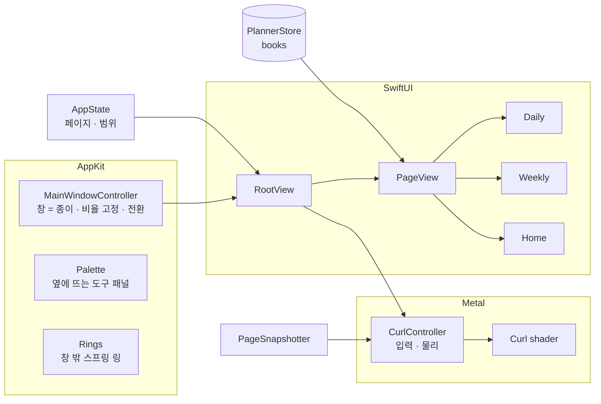

<div align="center">

# Spiralday

**창 하나가 곧 종이 한 장인 macOS 플래너.** · [spiralday.com](https://spiralday.com)
10분 단위 종이 플래너 형식으로 하루를 기록하고, 스프링 노트처럼 한 장씩 넘어갑니다.


[다운로드](#설치) · [기능](#주요-기능) · [사용법](#사용법) · [PDF 인쇄](#pdf로-뽑기) · [개발](#개발)

</div>

---

## 왜 만들었나

종이 플래너의 좋은 점은 **한 장 안에 하루가 다 보인다**는 것과 **넘기는 손맛**입니다. 캘린더 앱에는 둘 다 없습니다.

Spiralday 는 앱 안에 플래너를 그려 넣지 않고 **창 자체를 종이 한 장**으로 만들었습니다. 창의 빨강·노랑·초록 버튼이 종이 왼쪽 위에 놓이고, 스프링 링은 창 밖으로 튀어나와 있으며, 페이지는 **Metal 로 계산한 진짜 종이 말림**으로 넘어갑니다.

## 주요 기능

| | |
|---|---|
| 📓 **플래너 여러 권** | 권마다 이름 · **시작일(필수)** · 종료일(선택) · 표지 색. 시작일 이전 / 종료일 이후로는 넘어가지 않고, 종료일이 없으면 계속 넘어갑니다. 권마다 기록 · 형광펜 · D-day 가 따로 저장됩니다. |
| 🗒 **일간** | 10분 단위 종이 플래너 구성 — DATE · D-DAY · COMMENT · TOTAL TIME · TASKS 15줄 · MEMO · TIMETABLE (06시–05시 × 10분). 글이 길면 아래 칸으로 이어 쓰고, 칸이 모자라면 줄 간격과 글씨가 함께 조금씩 줄어듭니다. |
| 📅 **주간** | MY GOAL (┌ … ┘ 강조), REVIEW OF THE WEEK ★, 월–일 7칸 — 할 일 10줄 · 타임테이블 · 하루 합계. |
| 📊 **홈** | 이번 주 · 이번 달 시간, 하루 평균, 연속 기록, 완료율, 최근 12주, 형광펜별 시간, 시간대 · 요일 패턴, 최근 35일 달력. |
| 🖍 **형광펜 타임테이블** | 팔레트에서 형광펜을 골라 10분 칸을 드래그로 칠하면 TOTAL TIME 이 계산됩니다. 타임테이블 위에 **손글씨 메모**, 🍴 **밥시간 화살표**. |
| ○ △ × → | 체크 박스를 누를 때마다 완료 → 일부 → 못함 → 미룸. **완료한 일에만 형광펜**이 그어지고, 같은 형광펜끼리 모입니다. |
| 🎨 **날마다 컬러** | 9가지 컬러 컨셉 — TOTAL TIME · 요일 · D-day · 체크 표시 색이 함께 바뀝니다. 기본값은 설정에서. |
| 🖨 **PDF 로 뽑기** | 일간 A4 세로 / **A4 반쪽 (두 장씩, 자르면 실물 크기)**, 주간 · 홈 A4 가로. 기간을 정해 한 번에. 벡터라 인쇄가 선명합니다. |
| 🔒 **내 Mac 에만** | 네트워크 없음, 계정 없음, 광고 없음. JSON 파일로 저장. |

## 화면

<table>
<tr>
<td width="38%" valign="top"><br><sub>일간</sub></td>
<td valign="top"><br><sub>주간 — 위쪽 스프링</sub><br><br><br><sub>홈 — 전체 통계</sub></td>
</tr>
</table>

## 설치

### 받아서 쓰기

1. [Releases](https://github.com/Grwaywee/spiralday/releases) 에서 `Spiralday-x.y.z-macOS.zip` 을 받아 압축을 풉니다.
2. `Spiralday.app` 을 **응용 프로그램** 폴더로 옮깁니다.
3. 처음 한 번은 앱을 **오른쪽 클릭 → 열기** 로 엽니다.
   개인이 만든 앱이라 Apple 공증을 받지 않아서, 그냥 더블클릭하면 macOS 가 막습니다. 그래도 막히면:

   ```bash
   xattr -dr com.apple.quarantine "/Applications/Spiralday.app"
   ```

- macOS 14 Sonoma 이상, Apple Silicon · Intel 모두 지원

### 직접 빌드

Xcode 16 이상 (Swift 6 툴체인) 이 필요합니다.

```bash
git clone https://github.com/Grwaywee/spiralday.git
cd spiralday
./build.sh                  # → build/Spiralday.app (이 Mac 용)
./build.sh --release        # → 유니버설 빌드 + dist/Spiralday-x.y.z-macOS.zip
```

## 사용법

처음 열면 **튜토리얼**이 플래너 만들기부터 안내합니다. (설정 → 튜토리얼 다시 보기)


### 넘기기

| 동작 | 방법 |
|---|---|
| 다음 / 이전 장 | `→` / `←`, 팔레트 ‹ ›, `⌘]` / `⌘[` |
| 잡고 넘기기 | 종이 아래 모서리를 끌기 (마우스를 올리면 모서리가 살짝 들려요) |
| 트랙패드 | 두 손가락 가로 스와이프 |
| 오늘 | `T` · `⌘T` |
| 홈 / 주간 / 일간 | `H` / `W` / `D` · `⌘0` / `⌘1` / `⌘2` |

### 쓰기

| 동작 | 방법 |
|---|---|
| 할 일 | 빈 줄을 눌러 쓰기, `Return` 으로 같은 형광펜 아래 줄에 이어 쓰기 |
| 체크 | 체크 박스 클릭 (○ → △ → × → → → 없음) |
| 형광펜 | 팔레트에서 펜 클릭 또는 `1`–`7`, 지우개 `E` |
| 시간 칠하기 | 타임테이블 드래그 (같은 색을 다시 칠하면 지워져요) |
| 글씨 / 밥시간 | 팔레트의 **글씨** · **밥** 을 고르고 칸을 누르거나 끌기 |
| 오늘의 컬러 | 팔레트의 색 동그라미 (오른쪽 클릭: 기본값으로) |
| 편집 끝 | `Esc` 또는 종이 빈 곳 클릭 |

### 설정 (`⌘,`)

플래너(여러 권) · 형광펜 이름/색/순서/TOTAL TIME 포함 · 컬러 컨셉 기본값 · D-day (최대 2개) · PDF · 단축키 · 데이터 백업

## PDF로 뽑기

`⌘P` 또는 설정 → PDF

| 종류 | 용지 | 한 장에 |
|---|---|---|
| 일간 | A4 세로 | 하루 |
| 일간 | **A4 가로, 반씩** | 이틀 — 가운데 선을 따라 자르면 실물 플래너 크기 |
| 주간 | A4 가로 | 한 주 |
| 홈 | A4 가로 | 통계 |

기록이 없는 날은 빈 양식으로 나오니, 인쇄해서 종이 플래너로도 쓸 수 있습니다.

## 데이터

```
~/Library/Application Support/Spiralday/
├── library.json          # 플래너 목록, 펼친 플래너
└── books/<id>.json       # 플래너 한 권의 기록 · 형광펜 · D-day
```

입력은 즉시 자동 저장됩니다 (원자적 쓰기, 종료 시 즉시 저장). 백업은 폴더째 복사하거나 설정 → 데이터 → 백업 내보내기.

## 아키텍처



- **디자인 단위** — 페이지는 디자인 단위 좌표로 그립니다 (일간 1277×2000, 주간·홈 2000×1277). 창 크기에 맞춰 `u = 창 너비 / 디자인 너비` 를 곱해 그립니다.
- **페이지 넘김** — 넘김이 시작되기 전에 앞뒤 페이지를 비트맵으로 미리 그려 두고, 원통형 말림 모델을 픽셀 셰이더로 계산합니다 (뒷면 비침, 그림자, 안티에일리어싱, 스프링 물리). 셰이더는 실행 중 한 번 컴파일되어 별도 Metal 툴체인이 필요 없습니다.
- **흘려 쓰기** — CoreText 로 손글씨 줄바꿈을 계산해 인쇄된 줄에 맞추고, 넘치면 줄 수를 늘리면서 간격과 글씨를 같은 비율로 줄입니다.

| 폴더 / 파일 | 역할 |
|---|---|
| `WindowController.swift` · `Palette.swift` · `Rings.swift` | 창 = 종이, 도구 팔레트, 창 밖 스프링 |
| `DailyTemplate.swift` · `DailyPage.swift` | 일간 양식 인쇄 레이어 / 손글씨 레이어 |
| `WeeklyPage.swift` · `HomePage.swift` · `HomeStats.swift` | 주간, 홈 통계 |
| `Components.swift` · `RuledText.swift` | 인라인 편집, 체크 표시, 타임테이블 레이어, 흘려 쓰기 |
| `Curl/` | Metal 페이지 넘김 엔진 |
| `Settings.swift` · `Onboarding.swift` · `PDFExport.swift` | 설정, 튜토리얼, PDF |
| `Models.swift` | 플래너(책) · 기록 · 저장 |

## 개발

```bash
swift build
.build/debug/Spiralday --demo                # 샘플 데이터 (실제 기록을 건드리지 않음)
.build/debug/Spiralday --snapshot ./out      # 페이지 · 넘김 프레임 PNG
.build/debug/Spiralday --pdf-test ./out      # PDF 레이아웃 4종 샘플
```

## 로드맵

- [ ] 월간 페이지
- [ ] iCloud Drive 동기화 (선택)
- [ ] 종이 넘김 소리 (선택)

## 라이선스

[MIT](LICENSE) © 2026 LeanAgileHungry Inc.

- 손글씨 폰트 **Poor Story** — © YoonDesign Inc., [SIL Open Font License 1.1](Resources/Fonts/OFL-PoorStory.txt)
- 양식 구성은 10분 단위 스터디 플래너 형식에서 영감을 받았으며, 상표와 로고는 포함하지 않습니다.
