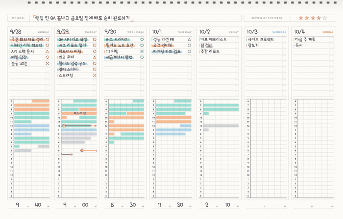
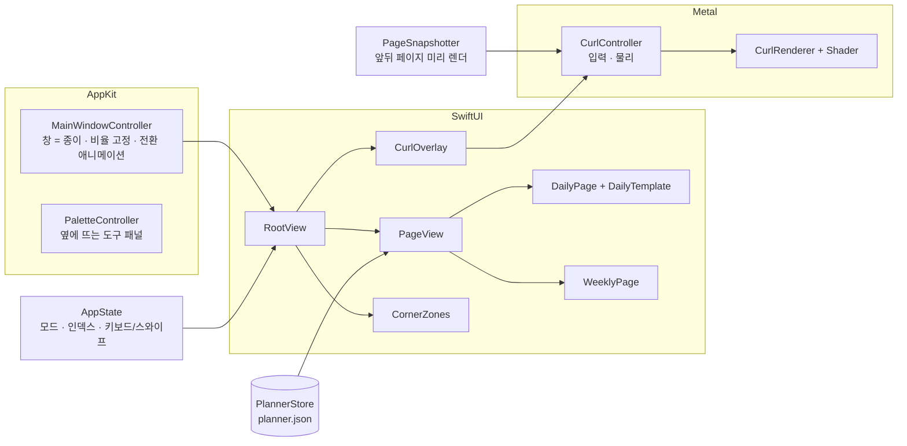

<div align="center">

# Paper Planner

**창 하나가 곧 종이 한 장인 macOS 업무 플래너.**
10분 단위 종이 플래너 형식으로 하루를 기록하고, 진짜 종이처럼 스프링에서 넘어갑니다.


</div>

---

## 목차

- [왜 만들었나](#왜-만들었나)
- [주요 기능](#주요-기능)
- [화면](#화면)
- [설치](#설치)
- [사용법](#사용법)
- [데이터와 개인정보](#데이터와-개인정보)
- [아키텍처](#아키텍처)
- [페이지 넘김 엔진](#페이지-넘김-엔진)
- [개발](#개발)
- [로드맵](#로드맵)
- [라이선스](#라이선스)

## 왜 만들었나

종이 플래너의 좋은 점은 **한 장 안에 하루가 다 보인다**는 것과 **넘기는 손맛**입니다.
기존 캘린더 앱은 둘 다 없습니다. Paper Planner 는

- 앱 안에 캘린더를 "그려 넣지" 않고, **창 자체를 종이 한 장**으로 만들었습니다. 창의 빨강·노랑·초록 버튼이 종이 왼쪽 위에 그대로 놓입니다.
- 일간 페이지는 **10분 단위 종이 플래너 형식**을 따릅니다 (1277 : 2000).
- 페이지는 **Metal 로 계산한 실제 종이 말림(page curl)** 으로 스프링 쪽을 향해 넘어갑니다.

## 주요 기능

| | |
|---|---|
| 🗒 **창 = 종이** | 제목 막대 없이 종이가 창 전체. 창 비율이 페이지 비율로 고정되고, 주간 ↔ 일간 전환 시 창 모양이 부드럽게 바뀝니다. |
| 📐 **양식 1:1 재현** | COMMENT · TOTAL TIME · TASKS 15줄(5줄마다 굵은 선, 점선 체크 박스) · MEMO 3줄 · TIMETABLE 6시–5시 × 10분 6칸. |
| 📄 **진짜 종이 넘김** | 원통형 말림 모델, 종이 뒷면 비침, 부드러운 그림자, 스프링 물리, 최대 120 Hz. 모서리를 잡고 끌거나 트랙패드로 스와이프. |
| 🖍 **형광펜 타임테이블** | 떠 있는 팔레트에서 형광펜을 고르고 타임테이블을 드래그하면 10분 단위로 칠해집니다. 카테고리별 시간과 TOTAL TIME 자동 계산. |
| ○ △ × → | 할 일 체크 박스를 누를 때마다 완료 → 일부 → 못함 → 미룸. 오른쪽 클릭으로 형광펜 색, 내일로 미루기, 삭제. |
| 📅 **주간 페이지** | MY GOAL, 주간 회고 별점, 월–일 7칸(할 일 10줄 + 타임테이블 + 하루 합계). 날짜를 누르면 그날 일간으로. |
| 🔒 **로컬 전용** | 네트워크 없음, 계정 없음. JSON 파일 하나. |

## 화면

<table>
<tr>
<td width="38%" valign="top"><br><sub>일간 — 10분 단위 구성</sub></td>
<td valign="top"><br><sub>주간 — 위쪽 스프링 제본</sub><br><br><br><sub>주간은 아래에서 위로 넘어갑니다</sub></td>
</tr>
</table>

## 설치

**요구 사항:** macOS 14 Sonoma 이상 · Xcode 16 이상 (Swift 6 툴체인)

```bash
git clone https://github.com/Grwaywee/paper-planner.git
cd paper-planner
./build.sh                      # → build/Paper Planner.app
open "build/Paper Planner.app"
```

응용 프로그램 폴더에 두려면:

```bash
cp -R "build/Paper Planner.app" /Applications/
```

> 손글씨 폰트(나눔손글씨 펜)는 macOS 가 제공하는 다운로드형 시스템 폰트라서 처음 실행할 때 자동으로 활성화됩니다. 인터넷이 없으면 그동안 기본 글꼴로 보입니다.

## 사용법

### 넘기기

| 동작 | 방법 |
|---|---|
| 다음 / 이전 장 | `→` / `←`, 팔레트의 ‹ ›, `⌘]` / `⌘[` |
| 잡고 넘기기 | 종이 아래 모서리를 끌기 (마우스를 올리면 모서리가 살짝 들립니다) |
| 트랙패드 | 두 손가락 가로 스와이프 — 손가락을 따라 종이가 넘어갑니다 |
| 오늘로 | `T`, 팔레트의 **오늘**, `⌘T` |
| 주간 / 일간 | `W` / `D`, 팔레트, `⌘1` / `⌘2` |

### 쓰기

| 동작 | 방법 |
|---|---|
| 할 일 쓰기 | 빈 줄을 클릭하고 입력, `Return` 으로 다음 줄 |
| 체크 표시 | 줄 오른쪽 체크 박스 클릭 (○ → △ → × → → → 없음) |
| 형광펜 선택 | 팔레트에서 펜 클릭, 또는 `1`–`7` / 지우개 `E` |
| 시간 칠하기 | 타임테이블을 드래그 (같은 색을 다시 칠하면 지워짐) |
| 펜 이름 바꾸기 | 팔레트의 펜을 더블클릭 (TOTAL TIME 포함 여부도 여기서) |
| 편집 끝내기 | `Esc` 또는 종이 빈 곳 클릭 |

기본 형광펜: 집중 업무 · 미팅 · 소통·메일 · 기획 · 학습 · 개인 · 휴식·이동 (개인과 휴식·이동은 TOTAL TIME 에서 제외)

## 데이터와 개인정보

- 저장 위치: `~/Library/Application Support/PaperPlanner/planner.json`
- 입력 즉시 자동 저장 (0.6초 디바운스, 종료 시 즉시 저장, 원자적 쓰기)
- 네트워크 요청 없음. 백업은 이 파일 하나만 복사하면 됩니다.

```jsonc
{
  "days":  { "2026-09-29": { "tasks": [...], "slots": [/* 144 칸, -1 = 빈 칸 */], "comment": "...", "memos": [...] } },
  "weeks": { "2026-09-28": { "goal": "...", "review": "...", "stars": 4 } },
  "prefs": { "categories": [...], "lastKind": "daily" }
}
```

## 아키텍처



**디자인 단위.** 모든 페이지는 디자인 단위 좌표로 그립니다 (일간 1277 × 2000, 주간 2000 × 1277). 실제 크기는 `u = 창 너비 / 디자인 너비` 를 곱해 그리므로 창 크기와 상관없이 비율이 정확히 유지됩니다. 인쇄된 부분(선, 점선, 라벨, 숫자)은 하나의 `Canvas` 로, 손으로 쓰는 부분만 SwiftUI 뷰로 올립니다.

| 파일 | 역할 |
|---|---|
| `WindowController.swift` | 창 = 종이, 비율 고정, 주간↔일간 창 모양 전환, 확대(초록 버튼) 계산, 날짜 제목 |
| `Palette.swift` | child panel 로 창 옆에 붙는 도구 팔레트 (비활성화 패널이라 입력 포커스를 뺏지 않음) |
| `PageView.swift` | 페이지 구성, `PageSnapshotter`(비트맵 캐시·선렌더), 모서리 조작 영역 |
| `DailyTemplate.swift` / `DailyPage.swift` | 일간 양식 인쇄 레이어 / 입력 레이어 |
| `WeeklyPage.swift` | 주간 양식 |
| `Components.swift` | 인라인 편집, 체크 표시, 형광펜 칠하기 레이어 |
| `Curl/` | 페이지 넘김 엔진 (아래) |
| `Models.swift` | 데이터 모델, 저장소 |

## 페이지 넘김 엔진

`Sources/PaperPlanner/Curl/`

1. **스냅샷.** 넘김이 시작되는 순간 현재 페이지와 도착 페이지 비트맵이 필요합니다. `PageSnapshotter` 가 한가할 때 앞뒤 페이지를 미리 그려 두어서 첫 프레임에 지연이 없습니다.
2. **기하.** 상태는 점 하나 — 종이 모서리 K 를 잡은 손가락 위치 F 입니다. 접힘 축은 K→F 의 수직 이등분선, 종이는 반지름 r 의 원통을 따라 말립니다. r 은 넘김 중간에 가장 크고 처음·끝에는 평평해집니다.
3. **셰이더.** 픽셀마다 (아래 페이지 → 말린 앞면 → 말린 뒷면) 을 해석적으로 계산합니다. 뒷면은 종이 결과 앞면 잉크의 옅은 비침, 원통 음영과 하이라이트, 아래 페이지로 떨어지는 부드러운 그림자, fwidth 기반 안티에일리어싱.
4. **모션.** 드래그는 아주 짧은 임계 감쇠로 손가락을 따라가고, 놓으면 속도를 이어받은 스프링으로 완료/복귀합니다. 연속 입력은 큐잉 + 가속.
5. **색 정확도.** 텍스처와 `CAMetalLayer` 모두 sRGB 로 맞춰서, 오버레이가 켜지고 꺼질 때 색이 튀지 않습니다.
6. **툴체인 독립.** Metal 셰이더는 소스 문자열로 두고 실행 시 한 번 백그라운드에서 컴파일합니다 (별도 Metal Toolchain 불필요).

## 개발

```bash
swift build                                     # 디버그 빌드
.build/debug/PaperPlanner --demo                # 샘플 데이터 (실제 파일을 건드리지 않음)
.build/debug/PaperPlanner --snapshot ./out      # 페이지·넘김 프레임 PNG 렌더
```

`--snapshot` 은 `daily_blank.png` 를 **1277 × 2000 픽셀**로 출력합니다.

## 로드맵

- [ ] 월간 페이지
- [ ] PDF 로 내보내기 / 인쇄
- [ ] iCloud Drive 동기화 (선택)
- [ ] 종이 넘김 소리 (선택)
- [ ] 키보드만으로 할 일 이동

## 라이선스

[MIT](LICENSE) © 2026 LeanAgileHungry Inc.

양식의 구성은 10분 단위 스터디 플래너 형식에서 영감을 받았으며, 상표와 로고는 포함하지 않습니다.
